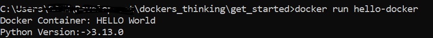

1. Create python module `main.py`
2. create `Dockerfile` 

----
### [Docker desktop](https://docs.docker.com/engine/install/) already installed .
---

#### How to run the container ?
1. navigate to folder where Dockerfile is
2. create an image `docker build -t hello-docker .`
then check `docker image ls` or `docker images -a`

3. Run the container `docker run hello-docker`

Note: If content changed, and image need to be current, run build command.

# docker-compose
1. create `docker-compose.yml`
2. run `docker-compose up` will build image and start the container